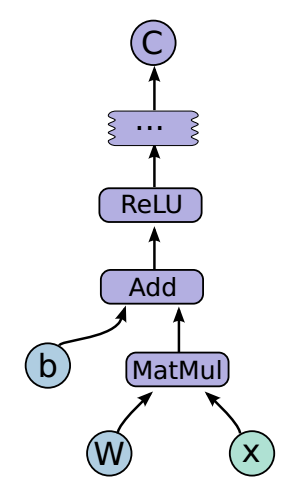
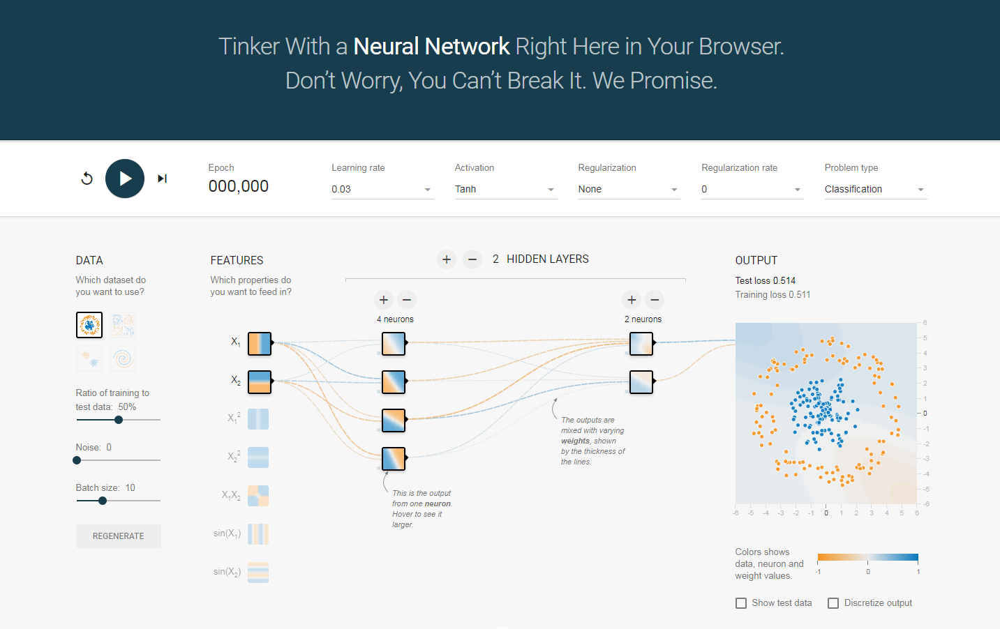

## TF入门

关于tf中的函数，在这里不会讲很多，自己用到去学习，并且有些函数更新比较快会替换成别的函数名。

### 1. TF计算模型--计算图

#### I 计算图的概念

TensorFlow名字就说明了他最重要的两个概念--Tensor和Flow.Tensor就是张量（可理解为多为数组），Flow(流)，直观的展现了张量之间通过计算相互转化的过程。TF是通过计算图的形式展现计算的编程系统，TensorFlow中的每一个计算都是计算图上的一个节点，而几点之间边描述了计算之间的依赖关系


**图1：通过TensorBoard可视化的神经元图**

#### II 计算图的使用

TensorFlow程序一般可以分为两个阶段，第一个阶段一般定义计算图中的所有计算，比如在验证TF安装成功的代码中，先定义了两个输入，然后计算了一个计算得到他们的和。第二个阶段为执行计算（第3节介绍），定义阶段的样例：

```python
import tensorflow as tf

a = tf.constant([1.0,2.0],name='a')
b = tf.constant([2.0,3.0],name='b')

result = a + b
```
在这个过程中，tf会自动将定义的计算转化为计算图上的节点，在TF中系统会自动维护一个默认的计算图，通过tf.get_default_graph函数可以获得当前默认的计算图

```python
#通过a.graph可以查看张量所在的计算图
print(a.graph is tf.get_default_graph())
```

当然除了默认的计算图，TF支持通过tf.graph函数来生成新的计算图。不同计算图的张量和运算都不会共享

```python
import tensorflow as tf

g1 = tf.Graph()
with g1.as_default():
	#在计算图g1中定义变量v
	v = tf.get_variable('v',initializer=tf.zero_initializer(shape=[1]))

g2 = tf.Graph()
with g2.as_default():
	#g2中定义v
	v = tf.get_variable('v',initializer=tf.ones_initializer(shape=[1]))

#g1中读取v
with tf.Session(graph=g1) as sess:
	initialize_op = tf.global_variables_initializer ()
	sess.run(initialize_op)
	with tf.variable_scope("",reuse=True):
		print(sess.run(tf.get_variable('v')))
	
```

TF中的计算图不仅可以用来隔离张量和计算。还提供了管理张量和计算的机制，计算图可以通过tf.Graph.device函数来指定运算计算的设备，这位TF使用GPU提供机制。下面的程序将加法跑在GPU上

```python
g = tf.Graph()
#指定计算运行的设备
with g.device('/gpu:0'):
	result = a + b
```

此外有效的整理TF程序中的资源也是计算图中的一个重要功能。在一个计算图中，可以通过集合（collection)来管理不同类别的资源。比如可以通过tf.add_to_collection函数可以将资源加入一个或多个集合，然后通过tf.get_collection获取一个集合里的所有资源。这里的资源可以是张量，变量，程序队列，等等。

---

### 2. TF数据模型--张量

张量是TF中管理数据的形式，TF中所有的数据都是通过张量的形式来表示的，功能上可以把张量理解为多维数组，零阶张量就是一个数，一阶张量是向量（1D数组）,n阶张量可以理解为nD数组。TF中并不是采用这种数组的形式，它只是对运算结果的引用，在张量中并没有保存数字，它保存的是如何得到这些数字的计算过程。

```python
import tensorflow as tf
#tf.constant是一个计算，这个计算的结果保存为一个张量，保存在变量a中

a = tf.constant([1.,2.],name='a')
b = tf.constant([2.,3.],name='b')

result = a + b

print(result)

#输出结果：

Tensor('add:0',shape=(2,),dtype=float32)
```

从结果可以看出，TF和Numpy不同，TF计算的结果不是一个具体的数，而是一个张量结构，一个张量中主要的结构有：名字，维度，类型。

+ 名字(name)： 是张量的唯一标识，同时给出这个张量是如何计算出来的，张量和计算图节点所计算的结果是对应的，名字格式为，**节点名称：张量来自节点的第几个输出** ，add:0表示add节点的输出的第一个结果

+ 维度(shape): 描述了张量的维度信息，shape=(2,)表示张量是一个1D数组，数组的长度是2，维度是张量很重要的一个概念（一定要注意）

+ 类型(type): 每一个张量都有一个唯一类型，自动进行类型检查，不匹配会报错的

```python
import tensorflow as tf
a = tf.constant([1,2],name='a')
#a = tf.constant([1,2],name='a'，dtype=tf.float32)
b = tf.constant([2.,3.],name='b')

result = a + b
#结果会报错。。。。。。
```
注意1： TF支持14种不同的数据类型（tf.float32,tf.float64,tf.int8,tf.int16,tf.int32,tf.int64,tf.unit8,tf.bool,tf.complex64,tf.complex128)

注意2： 张量的使用方式，a.对中间计算结果的引用（如上栗）b.计算图构造完成后，张量可以获得计算结果，即得到真实数字，虽然张量本身没有存储具体数字，通过会话(session)即可得到

```python
tf.Session().run(result)
```

---

### 3. TF运行模型--会话

TF通过会话(Session)来执行定义好的运算。会话拥有并管理TF程序运行的所有资源，当所有计算完成后关闭会话帮助系统回收资源，一般由两种使用方式

```python
#创建一个会话
sess = tf.Session()
#使用创建好的会话来得到自己关心的计算结果
sess.run(...)
#关闭会话使得本次运行中使用的资源可以被释放
sess.close()
#很像我们Python中的I/O系统
```

这种方法不好，原因是当程序出现异常导致退出时，关闭会话可能不会被执行，会导致资源泄露。为了解决这个问题TF可以通过Python的上下文管理器来使用会话

```python
#通过Py的上下文管理器来创建
with tf.Session() as sess:
	sess.run(...)
#不需要close()当退出上下文管理器时资源会被自动释放
```

上文中介绍了TF会自动生成一个默认的计算图，如果计算图没有被指定运算会自动加入到默认计算图中，TF的会话也有类似的机制，但TF不会生成默认会话，需要手动指定，默认会话指定后可以通过tf.Tensr.eval函数来计算一个张量的取值

```python
sess = tf.session()
with sess.as_default():
	print(result.eval())
	print(sess.run(result))
```

而在一些交互的脚本环境中(Ipython,jupyter),通过这种默认方式来获取张量的取值会更方便，所以TF提供了一种在交互环境下直接构建默认会话的函数：tf.InteractiveSession()

```python
sess = tf.InteractiveSession()
print(result.eval())
sess.close()
```

注意：无论使用哪种方法都可以通过ConfigProto Protocol Buffer来配置需要生成的会话

```python
config = tf.ConfigProto(all_solft_placement = True,log_device_placement=True)
#all_solft_placement GPU 自动跳转CPU
#log_device_placement=True 日志中记录每个节点计算被安排在哪个设备
sess1 = tf.InteractiveSession(config = config)
sess2 = tf.Session(config = config)
```

------

### 4. TF游乐场

TensorFlow游乐场(http://playground.tensorflow.org)是通过网页浏览器可以训练简单神经网络的可视化工具


**图2：TensorFlow游乐场截图**


