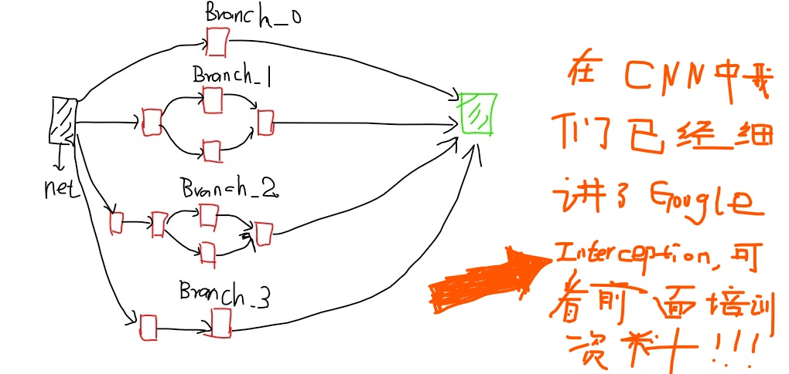

## TF实现CNN举例

这一部分我们看一下如何使用TensorFlow实现CNN(卷积神经网络)，我们在前面的培训中已经全面的介绍了CNN的知识，包括经典的模型像LeNet，AlexNet,Google Inception，ResNet,VGG16(19),YOLO等，[点这里进入CNN学习模式](https://dataxujing.github.io/%E6%B7%B1%E5%BA%A6%E5%AD%A6%E4%B9%A0%E4%B9%8BCNN/),这里只举两个简单的栗子。

### 1. LeNet-5

LeNet-5大家最熟悉不过了，直接coding

```python
#x = tf.palceholder(tf.float32,[BATCH_SIZE,IAMGE_SIZE,IMAGE_SIZE,NUM_CHANNELS],name='x-input')

import trnsorflow as tf

INPUT_NODE = 784
OUTPUT_NODE = 10

IMAGE_SIZE = 28
NUM_CHANNELS = 1
NUM_LABELS = 10

CONV1_DEEP = 32
CONV1_SIZE = 5

CONV2_DEEP = 64
CONV2_SIZE = 5

FC_SIZE = 512

def inference(input_tensor,train,regularizer):
	#layer1
	with tf.variable_scope('layer1-conv1'):
		conv1_weghts = tf.get_variable('weight',[CONV1_SIZE,CONV1_SIZE,NUM_SIZE,NUM_CHANNELS,CONV1_DEEP],initializer=tf.truncated_initializer(stddev=0.1))
	    conv1_biases = tf.get_variable('bias',[CONV1_DEEP],initializer=tf.constant_initializer(0.))

	    conv1 = tf.nn.conv2d(input_tensor,conv1_weights,strides=[1,1,1,1]padding='SAME')
	    relu1 = tf.nn.relu(tf.nn.bias_add(conv1,conv1_biases))
	#pool1
	with tf.name_scope('layer1-pool'):
		pool1 = tf.nn.max_pool(relu1,ksize = [1,2,2,1],strides=[1,2,2,1],padding='SAME')

	#layer2
	with tf.variable_scope('layer2-conv2')：
		conv2_weights = tf.get_variable('weight',[CONV2_SIZE,CONV2_DEEP,initalizer=tf.tuncated_normal_initalizer(stddev=0.1)])
		conv2_biases = tf.get_variable('bias',[SONV2_DEEP],initalizer=tf.constant_initializer(0.0))
		conv2 = tf.nn.conv2d(pool1,con2_weights,strides=[1,1,1,1],padding='SAME')
		relu2 = tf.nn.relu(tf.nn.bias_add(conv2,conv2_biases))
	#pool2
	with tf.name_scope('layer2-pool2'):
		pool2 = tf.nn.max_pool(relu2,ksize=[1,2,2,1],strides=[1,2,2,1],padding = 'SAME')

	pool_shape = pool2.get_shape().as_list()
	#[batch,size1,size2,deepsize(channels)]
	nodes = pool_shape[1]*pool_shape[2]*pool_shape[3]
	reshaped = tf.reshape(pool2,[pool_shape[0],nodes])

	#FC_1
	with tf.variable_scope('layer3-fc1'):
		fc1_weights = tf.get_variable('weight',[nodes,FC_SIZE],initializer=tf.truncated_normal_initializer(steddev=0.1))
		if regularizer != None:
			tf.add_to_collection('losses',regularizer(fc1_weights))
		fc1_biases = tf.get_variable('bias',[FC_SIZE],initializer=tf.constant_initializer(0.1))
		fc1 = tf.nn.relu(tf.matmul(reshaped,fc1_weights)+fc1_biasws)
		if train:
			fc1 = tf.nn.dropout(fc1,0.5)
	#这里要注意的是：CNN的正则化是加在全连接层的，CNN的dropout也是针对全连接层的，后面我们会将RNN的dropout和CNN不同

	#FC_2
	with tf.variable_scope('layer4-fc2'):
		fc2_weights = tf.get_variable('weight',[FC_SIZE,NUM_LABELS],initializer=tf.truncated_normal_initializer(steddev=0.1))
		if regularizer != None:
			tf.add_to_collection('losses',regularizer(fc2_weights))
		fc2_biases = tf.get_variable('bias',[NUM_LABELS],initializer=tf.constant_initilizer(0.1))
		logit = tf.matmul(fc1,fc2_weights)+fc2_biases

	return logit


#训练的过程同神经网络（DNN）相同，不想再赘述
1.定义placeholder()
2.定义评价指标，损失函数，学习率，滑动平均操作，及优化方法
3. 训练过程持久化模型
4. 打印训练结果

注意一点的是：loss = cross_entropy_mean+tf.add_n(tf.get_collection('losses'))

这些都非常简单，包括RNN也是同样的过程，同样也不再赘述

```
-----

### 2. Inception-v3

Googel Inception-v3我们也很熟悉了，Inception-v3有46层，有11个Inception模块组成。下图就是Inception模块的示意图，我们会用TensorFlow实现该模块。


**图1：Inception-v3主要构成模块**

我们使用TensorFloe-Sli工具来更加简洁的实现Inception,通过TF-Slim可以在一行代码实心CNN的前向传播，slim.conv2d有三个必填参数：输入节点的矩阵，当前卷积层过滤器的深度（过滤器的个数），过滤器的尺寸，可选的参数有过滤器的步长，是否全零填充，激活函数的选择，变量的命名空间等。

```python

with slim.arg_scope([slim.conv2d,slim.max_pool2d,slim.avg_pool2d],stride=1,padding='SAME'):
	#slim.arg_scope()用于设置默认的参数取值，第一个参数是一个函数列表，在这个列表中的函数将使用参数的默认取值，目的是为了降低coding的冗余。
	#此处省去Inception的其他结构，假设输入图片经过之前的网络传播结果保存在net中，net=上一层的输出节点的矩阵。

	with tf.variable_scope('maxed_7c'):
		with tf.variable_scope('Branch_0'):
			branch_0 = slim.conv2d(net,320,[1,1],scope='Conv2d_0a_1X1')
		with tf.variable_scope('Branch_1'):
			branch_1 = slim.conv2d(net,384,[1,1],scope='Conv2d_0a_1X1')
			branch_1 = tf.concat(3,[
				slim.conv2d(branch_1,384,[1,3],scope='Conv2d_0b_1X3'),
				slim.conv2d(branch_1,384,[3,1],scope='Conv2d_0c_3x1')
				])
			#3代表矩阵在深度这个维度上进行矩阵链接

		with tf.variable_scope('Branch_2'):
			branch_2 = slim.conv2d(net,448,[1,1],scope='Conv2d_0a_1x1')
			branch_2 = slim.conv2d(branch_2,384,[3,3],scope='Conv2d_0b_3x3')
			branch_2 = tf.concat(3,[
				slim.conv2d(branch_2,384,[1,3],scope='Conv2d_0c_1x3'),
				slim.conv2d(branch_2,384,[3,1],scope='Conv2d_0c_3x1')
				])
		with tf.variable_scope('Branch_3'):
			branch_3 = slim.avg_pool2d(net,[3,3],scope='AvgPool_oa_3x3')
			branch_3 = slim.conv2d(branch_3,182,[1,1],scope='Conv2d_0b_1x1')
		net = tf.concat(3,[branch_0,branch_1,brnch_2,branch_3])

```

---


### 3. 迁移学习

随着模型层数及复杂度的增加，训练深度模型会非常困难，一方面需要有大量的带标签数据，即使收集到了这些海量的有标签数据，训练一个复杂的模型也需要少则几天多则几周，几个月的时间，为了解决标注数据和训练时间的问题，可以使用迁移学习。

所谓迁移学习就是将一个问题上训练好的模型通过简单额调整使其适用于一个新的问题。

```python
def main(_):
    # 读取所有图片。
    image_lists = create_image_lists(TEST_PERCENTAGE, VALIDATION_PERCENTAGE)
    n_classes = len(image_lists.keys())
    # 读取已经训练好的Inception-v3模型。
    # 谷歌训练好的模型保存在了GraphDef Protocol Buffer中，里面保存了每一个节点取值的计算方法以及变量的取值。
    # TensorFlow模型持久化的问题在第5章中有详细的介绍。
    with gfile.FastGFile(os.path.join(MODEL_DIR, MODEL_FILE), 'rb') as f:
        graph_def = tf.GraphDef()
        graph_def.ParseFromString(f.read())
    # 加载读取的Inception-v3模型，并返回数据输入所对应的张量以及计算瓶颈层结果所对应的张量。
    bottleneck_tensor, jpeg_data_tensor = tf.import_graph_def(graph_def, return_elements=[BOTTLENECK_TENSOR_NAME, JPEG_DATA_TENSOR_NAME])
    # 定义新的神经网络输入，这个输入就是新的图片经过Inception-v3模型前向传播到达瓶颈层时的结点取值。
    # 可以将这个过程类似的理解为一种特征提取。
    bottleneck_input = tf.placeholder(tf.float32, [None, BOTTLENECK_TENSOR_SIZE], name='BottleneckInputPlaceholder')
    # 定义新的标准答案输入
    ground_truth_input = tf.placeholder(tf.float32, [None, n_classes], name='GroundTruthInput')
    # 定义一层全连接层来解决新的图片分类问题。
    # 因为训练好的Inception-v3模型已经将原始的图片抽象为了更加容易分类的特征向量了，所以不需要再训练那么复杂的神经网络来完成这个新的分类任务。
    with tf.name_scope('final_training_ops'):
        weights = tf.Variable(tf.truncated_normal([BOTTLENECK_TENSOR_SIZE, n_classes], stddev=0.001))
        biases = tf.Variable(tf.zeros([n_classes]))
        logits = tf.matmul(bottleneck_input, weights) + biases
        final_tensor = tf.nn.softmax(logits)
    # 定义交叉熵损失函数
    cross_entropy = tf.nn.softmax_cross_entropy_with_logits(logits=logits, labels=ground_truth_input)
    cross_entropy_mean = tf.reduce_mean(cross_entropy)
    train_step = tf.train.GradientDescentOptimizer(LEARNING_RATE).minimize(cross_entropy_mean)
    # 计算正确率
    with tf.name_scope('evaluation'):
        correct_prediction = tf.equal(tf.argmax(final_tensor, 1), tf.argmax(ground_truth_input, 1))
        evaluation_step = tf.reduce_mean(tf.cast(correct_prediction, tf.float32))

    with tf.Session() as sess:
        tf.global_variables_initializer().run()
        # 训练过程
        for i in range(STEPS):
            # 每次获取一个batch的训练数据
            train_bottlenecks, train_ground_truth = get_random_cached_bottlenecks(
                sess, n_classes, image_lists, BATCH, 'training', jpeg_data_tensor, bottleneck_tensor)
            sess.run(train_step, feed_dict={bottleneck_input: train_bottlenecks, ground_truth_input: train_ground_truth})
            # 在验证集上测试正确率。
            if i%100 == 0 or i+1 == STEPS:
                validation_bottlenecks, validation_ground_truth = get_random_cached_bottlenecks(
                    sess, n_classes, image_lists, BATCH, 'validation', jpeg_data_tensor, bottleneck_tensor)
                validation_accuracy = sess.run(evaluation_step, feed_dict={
                    bottleneck_input:validation_bottlenecks, ground_truth_input: validation_ground_truth})
                print('Step %d: Validation accuracy on random sampled %d examples = %.1f%%'
                      % (i, BATCH, validation_accuracy*100))
        # 在最后的测试数据上测试正确率
        test_bottlenecks, test_ground_truth = get_test_bottlenecks(sess, image_lists, n_classes,
                                                                       jpeg_data_tensor, bottleneck_tensor)
        test_accuracy = sess.run(evaluation_step, feed_dict={bottleneck_input: test_bottlenecks,
                                                                 ground_truth_input: test_ground_truth})
        print('Final test accuracy = %.1f%%' % (test_accuracy * 100))


```
----


