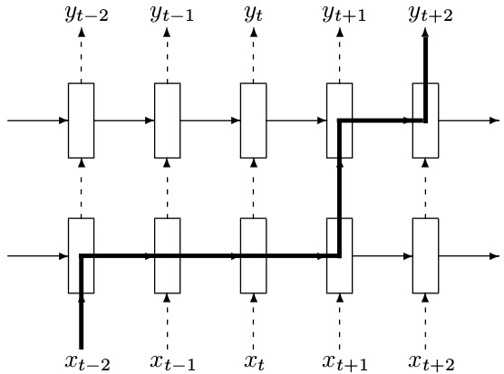
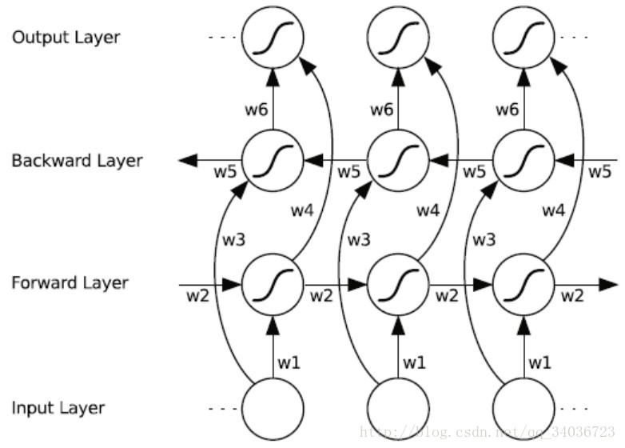

## TF实现RNN举例
关于RNN我们在前期的培训中已经介绍，包括基本的RNN结构，LSTM,GRU，双向循环神经网络，深层神经网络等，[要学习RNN请移步到这](https://dataxujing.github.io/%E6%B7%B1%E5%BA%A6%E5%AD%A6%E4%B9%A0%E4%B9%8BRNN/),因为简单的RNN结构在实际应用中并不常用，所以本节主要介绍：LSTM，深层循环神经网络，GRU,及双向循环神经网络的基本用法,其中后两者仅提供函数API，用法与前两者相同。

### 1.LSTM
定义一个LSTM结构，在TF中通过一句简单的命令就可以实现一个完整的LSTM结构。LSTM中使用的变量也会在该函数中自动声明


**图1：LSTM示意图**

```python

lstm_cell = tf.nn.rnn_cell.BasicLSTMCell(num_units, forget_bias=1.0, input_size=None, state_is_tupe=Flase, activation=tanh)
#num_units:图一中ht的维数，如果num_units=10,那么ht就是10维行向量
#forget_bias：遗忘门的偏执项
#input_size:[batch_size, max_time, size]。假设要输入一句话，这句话的长度是不固定的，max_time就代表最长的那句话是多长，size表示你打算用多长的向量代表一个word，即embedding_size（embedding_size和size的值不一定要一样）
#state_is_tuple:true的话，返回的状态是一个tuple:(c=array([[]]), h=array([[]]):其中c代表Ct的最后时间的输出，h代表Ht最后时间的输出，h是等于最后一个时间的output的
#图三向上指的ht称为output
#此函数返回一个lstm_cell，即图一中的一个A,说白了就是一个LSTM结构

初始化LSTM的初始状态（ct,记忆单元，状态单元）
state = lstm_cell.zero_state(batch_size,tf.float32)

#定义损失
loss = 0.0
#理论上RNN可以处理任意长度的序列，但在训练时为了避免梯度爆炸或弥散，回贵定一个最大的序列长度，就是这里的num_steps

for i in range(num_steps):
	#注意lstm的权值共享，字之后的时刻都将复用之前定义好的变量
	if i > 1:
		tf.get_variables_scope().resuse_variable()
	#每一步处理时间序列中的一个时刻。将当前时刻的输入和上一时刻的状态（state)传入定义好的lstm_cell得到当前LSTM结构的输出更新后的状态（newstate)
	lstm_output,state = lstm_cell(current_input,state)
	#loss是所有输出loss的和
	loss += calc_loss(finial_output,expected_outut)

	#注意：finial_output是lstm_output经过全连接得到或线性变换得到
	#激活函数式在计算当前记忆单元和ht时要用到的激活函数。

训练方法同DNN,CNN

```
----

### 2.深层LSTM

深层LSTM在RNN的培训中心我们只是提了概念并没有细讲。deepRNN是为了增强模型的表达能力，可以将每一个时刻上的循环体重复多次。



**图2：深度LSTM结构**

```python
#定义一个基本的LSTM结构作为循环体的基础结构。深层循环神经网络也支持使用其他循环结构
lstm = tf.nn.rnn_cell.BasicLSTMCell(num_units, forget_bias=1.0, input_size=None, state_is_tupe=Flase, activation=tanh)
#通过MultiRNNCell类实现深层循环网络的每一个时刻的前向传播过程。其中number_of_layers表示有多少层，也就是图一中的xt到ht需要经过多少个LSTM结构。

stacked_lstm = tf.nn.rnn_cell.MultiRNNCell([lstm]*number_of_layers)

state = stacked_lstm.zero_state(batch_size,tf.float32)

for i in range(len(num_steps)):
	if i > 0:
		tf.get_variable_scope().reuse_variables()
	stacked_lstm_output,state = stacked_lstm(current_input,state)
	final_output = fully_connected(stacked_lstm_output)
	loss += calc_loss(final_output,expected_output)
```

从代码上来看，TensorFlow只需要在BasicLSTMCell的基础上在封装一层MultiRNNCell就很容易实现deepRNN。

这里需要指出的是RNN的dropout,在CNN中已经指出了CNN的dropout,dropout的功能没有发生变化，但是循环神经网络只在不同循环体结构之间使用dropout,而不在同一层的循环体结构之间使用，也就是说在t-1时刻传递到t时刻，循环神经网络不会进行状态的dropout，直观的理解可以看到图2，图2中实线的箭头是不能进行dropout的，虚线箭头是可以进行dropout的。

```python
lstm = tf.nn.rnn_cell.BasicLSTMCell(......)

#使用DropoutWrapper来实现dropout功能，两个参数，一个是input_keep_prob，控制dropout的概率，一个是output_keep_prob可以控制输出的dropout概率

dropout_lstm = tf.nn.rnn_cell.DropoutWrapper(lstm,output_keep_prob=0.5)

#在使用dropout的基础上定义

stacked_lstm = tf.nn.rnn_cell.MultiRNNCell([dropout_lstm]*number_of_layers)
```

在此提示，这些模型的训练和评价和前面教导的模型时相同的，不再赘述

### 3.GRU及双向循环神经网络

tenforflow提供了tf.nn.rnn_cell.GRUCell()构建一个GRU单元

**图3：GRU示意图**

```python
gru_cell = tf.nn.rnn_cell.GRUCell(num_units, input_size=None, activation=tanh)
#参数参考lstm cell 使用
```

双向循环神经网络我们在RNN培训中心也已经讲到


**图4：双向循环神经网络示意图**


```python
API：
bidirectional_dynamic_rnn(
    cell_fw, #前向 rnn cell
    cell_bw, #反向 rnn cell
    inputs, #输入序列.
    sequence_length=None,# 序列长度
    initial_state_fw=None,#前向rnn_cell的初始状态
    initial_state_bw=None,#反向rnn_cell的初始状态
    dtype=None,#数据类型
    parallel_iterations=None,
    swap_memory=False,
    time_major=False,
    scope=None
)

#------------------------------------

def BiRNN(x,weights,biases):
    x = tf.transpose(x,[1,0,2])
    x = tf.reshape(x,[-1,n_input])
    x = tf.split(0,n_steps,x)
    lstm_fw_cell = tf.nn.rnn_cell.BasicLSTMCell(n_hidden,state_is_tuple=True)
    lstm_bw_cell = tf.nn.rnn_cell.BasicLSTMCell(n_hidden,state_is_tuple=True)
    outputs,_,_ = tf.nn.bidirectional_rnn(lstm_fw_cell,lstm_bw_cell,x,dtype=tf.float32)
    return tf.matmul(outputs[-1],weights['out'])+biases['out']

#注意：“_”作为临时性的名称使用。
#这样，当其他人阅读你的代码时将会知道，你分配了一个特定的名称，但是并不会在后面再次用到该名称。
#例如，上面例子中，你可能对outputs后面的变量值不感兴趣，此时就可以使用“_”。

```

其他：

```python
#简单RNN的API
tf.nn.rnn_cell.BasicRNNCell()

#不变长输入
tf.nn.static_rnn()

#变长输入
outputs, state = tf.nn.dynamic_rnn(cell, inputs, sequence_length=None)
注：dynamic_rnn 与 static_rnn 的主要区别是：前者可以接收具有不同长度的 mini-batch 序列。值得注意的是在同一 mini-batch 内的序列还是要 pad 成同一长度

#
tf.contrib.rnn.XXX()

```

更多内容参考：


https://mp.weixin.qq.com/s/PNkaX93uqPp1K5zVj4i03g

https://mp.weixin.qq.com/s/8hw6pAzUhoXrX4mD9HqIZQ

https://mp.weixin.qq.com/s/Mv-e8Pslm7v9VqfjSnkBwQ

https://mp.weixin.qq.com/s/W0MO4k3IDect9aOSzu7-Zg


----