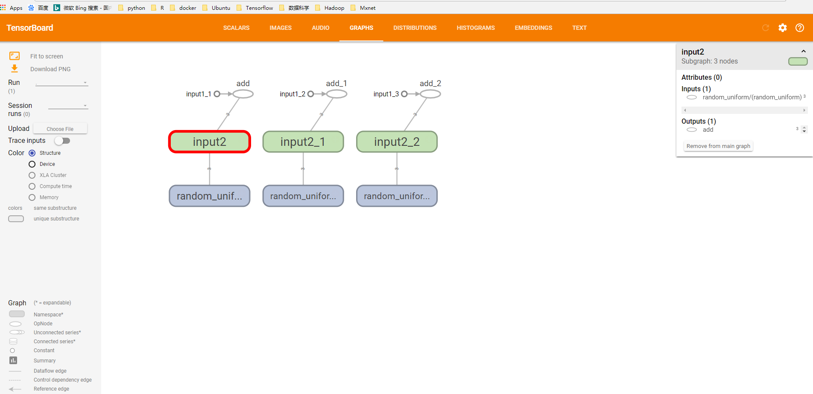
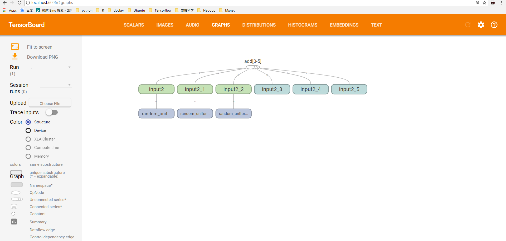
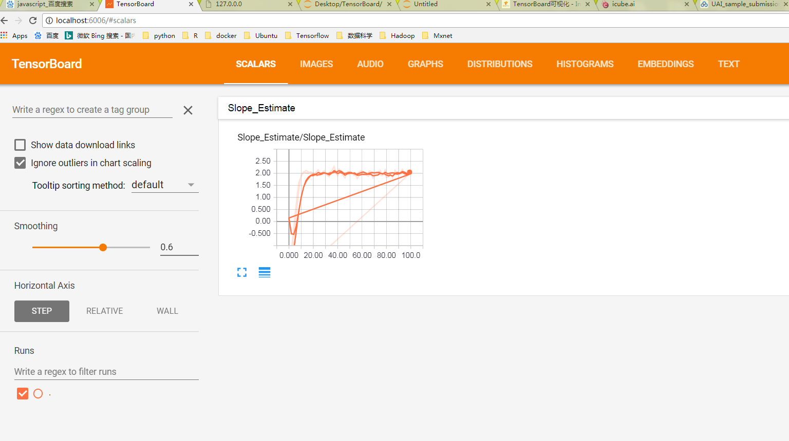
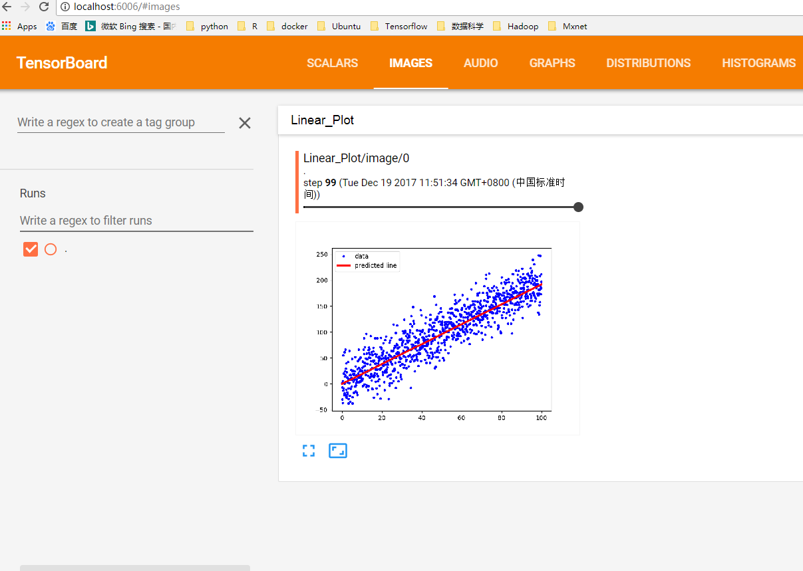
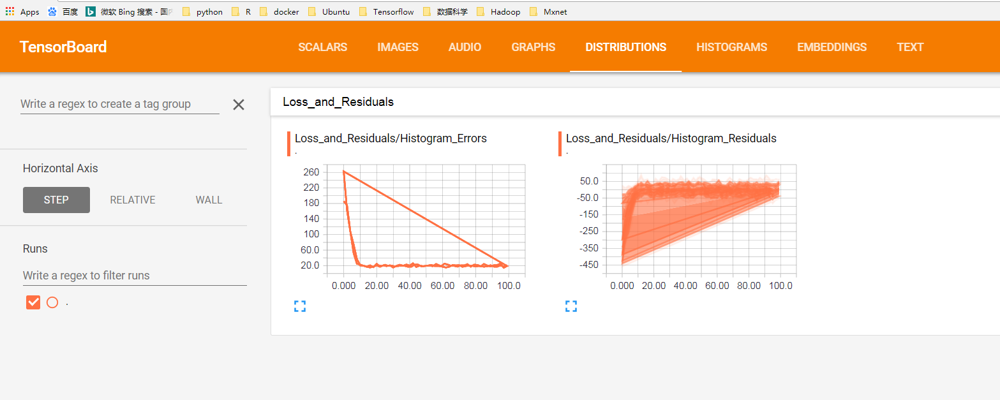
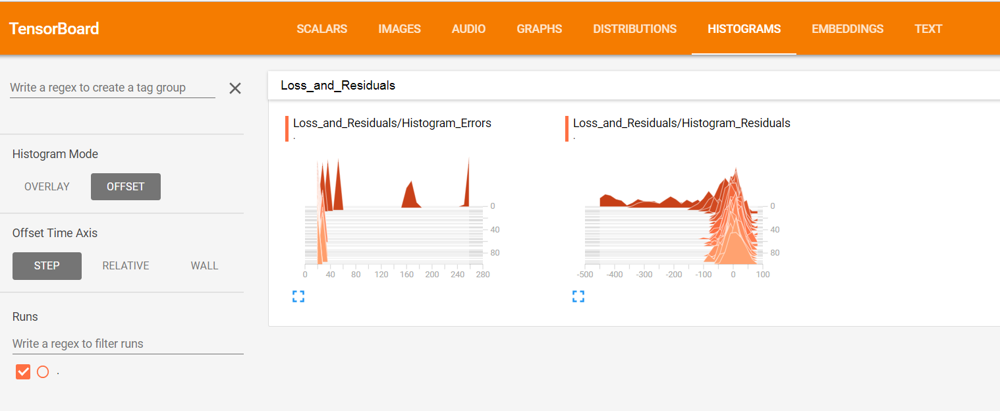

# TensorBoard可视化

为了更好的训练和优化模型，TensorFlow提供了一个可视化工具TensorBoard。TensorFlow可以有效的展示TensorFlow在运行过程中的计算图，各种指标随着时间的变化趋势以及训练中使用到的图像信息等。

#### 1.TensorBoard简介

TensorBoard是TensorFlow的可视化工具，它可以通过TensorFlow程序运行过程中输出的日志文件可视化TensorFlow程序的运行状态，TensorBoard会自动读取最新的TensorFlow日志文件，并呈现当前TensorFlow程序运行的最新状态。

```python
import tensorflow as tf

input1 = tf.constant([1.,2.,3.0],name='input1')
input2 = tf.Variable(tf.random_uniform([3]),name='input2')

output = tf.add_n([input1,input2],name='add')

#生成一个日志的writer,并将当前的TensoFlow计算图写入日志，TF提供了多种些日志文件的API

writer = tf.summary.FileWriter('path/log',tf.get_default_graph())
writer.close()
```

在终端中运行`tensorboard --logdir=path/log`默认端口号为6006，在浏览器中输入localhost:6006,会看到如下结果


**图1：使用TensorBoard可视化向量相加程序TensorFlow计算图结果**

可以看到界面上方有SCALARS, IMAGES, AUDIO, GRAPHS, DISTRIBUTIONS, HISTOGRAMS, EMBEDDINGS, TEXT，TensorBoard 中每一栏都对应了一类信息的可视化结果，后边会讲每一部分的功能。

-----

#### 2. TensorFlow计算图可视化

TensorBoard可视化得到的图并不仅是将TensorFlow计算图中的节点和边直接可视化，它会根据每个TensorFlow计算节点的命名空间来整理可视化得到的效果图，使得神经网络的整体结构不会被过多的细节所淹没。

+ 命名空间与TensorBoard图上节点

TensorFlow计算图中同一个命名空间下的所有节点会被缩略成一个节点，只有顶层的命名空间中的节点才会被显示在tensorBoard可视化效果图上。

```python
import tensorflow as tf 

with tf.name_scope('input1'):
    input1 = tf.constant([1.,2.,3.],name='input1')

with tf.name_scope('input2'):
    input2 = tf.Variable(tf.random_uniform([3]),name='input2')
output = tf.add_n([input1,input2],name='add')

writer = tf.summary.FileWriter('log1',tf.get_default_graph())
writer.close()
```
`tensoboard --logdir=path/log`,对比与图1的区别


**图2：改进后的加法程序TensorFlow计算图上的可视化效果图**

+ 节点信息

TensorBoard可以展示TensorFlow计算图上每个节点的基本信息以及运行时消耗的时间和空间。

```python
with tf.Session() as sess:
	tf.global_variable_initializer().run()
	for i in range(TRANING_STEPS):
		xs,ys = mnist.train.next_batch(BATCH_SIZE)

		for i % 1000 ==0：
			#配置运行时所需要记录的信息
			run_options = tf.RunOptions(trace_level = tf.RunOptions.FULL_TRACE)
			#运行时记录运行信息的proto
			run_metadata = tf,RubMetadata()
			#将配置信息与记录运行信息的proto传入运行的过程，从而记录运行时每一个节点的时间，空间开销信息

			_,loss_value,step = sess.run([train_op,loss,global_step],feed_dict={x:xs,y:ys},options = run_options,run_metadata=run_metadata)
			#将节点在运行时的信息写入日志文件
			train_writer.add_run_metadata(run_metadata,'steps%03d' % i)
			print('After %d training step(s), loss on training batch is %g. ' % (step,loss_value))

		else:
			_,loss_value,step = sess.run([train_op,loss,global_step],feed_dict={x:xs,y:ys})

```

------- 

#### 3. 监控指标可视化

上面主要是通过TensorBoard的GRAPHS栏可视化TensorFlow计算图的结构以及在计算图上的信息，TensorBoard除了可以可视化TensorFlow的计算图，还可以可视化TensorFlow程序运行过程的各种有助于了解程序运行状态的监测指标。

```python
import tensorflow as tf

from tensorflow.examples.tutorials.mnist import input_data

SUMMARY_DIR='LOG'
BATCH_SIZE = 100
TRAIN_STEPS = 30000

#生成变量监控信息，并定义成监控信息日志的操作。其中var给出了需要记录的张量，name给出了可视化结果中显示的图标名称，这个名称一般与变量名称一致‘

def variable_summaries(var,name):
    with tf.name_scope('summaries'):
        tf.summary.histogram(name,var)
        mean = tf.reduce_mean(var)
        tf.summary.scalar('mean/'+name,mean)
        stddev = tf.sqrt(tf.reduce_mean(tf.square(var-mean)))
        tf.summary.scalar('steddev/'+name,stddev)

#生成一个全连接层的神经网络

def nn_layer(input_tensor,input_dim,output_dim,layer_name,act = tf.nn.relu):
    with tf.name_scope(layer_name):
        with tf.name_scope('weights'):
            weights = tf.Variable(tf.truncated_normal([input_dim,output_dim],stddev=0.1))
            variable_summaries(weights,layer_name+'/weights')
        with tf.name_scope('biases'):
            biases = tf.Variable(tf.constant(0.0,shape=[output_dim]))
            variable_summaries(biases,layer_name+'/biases')
        
        with tf.name_scope('Wx_plus_b'):
            preactivate = tf.matmul(input_tensor,weights) + biases
            tf.summary.histogram(layer_name+'preactivations',preactivate)
        activations = act(preactivate,name='activation')
        tf.summary.histogram(layer_name+'/activations',activations)
        return activations
    
    
def main(_):
    mnists = input_data.read_data_sets('data',one_hot = True)
    
    with tf.name_scope('input'):
        x = tf.placeholder(tf.float32,[None,784],name='x-input')
        y_ = tf.placeholder(tf.float32,[None,10],name='y-input')
    
    with tf.name_scope('input_reshape'):
        image_shape_input = tf.reshape(x,[-1,28,28,1])
        tf.summary.image('input',image_shape_input,10)
    
    hidden1 = nn_layer(x,784,500,'layer1')
    y = nn_layer(hidden1,500,10,'layer2',act = tf.identity)
    
    with tf.name_scope('cross_entropy'):
        cross_entropy = tf.reduce_mean(tf.nn.softmax_cross_entropy_with_logits(labels = y,logits = y_))
        tf.summary.scalar('cross entropy',cross_entropy)
    with tf.name_scope('train'):
        train_step = tf.train.AdamOptimizer(0.001).minimize(cross_entropy)
        
    with tf.name_scope('accuracy'):
        with tf.name_scope('correct_prediction'):
            correct_prediction = tf.equal(tf.argmax(y,1),tf.argmax(y_,1))
        with tf.name_scope('accuracy'):
            accuracy = tf.reduce_mean(tf.cast(correct_prediction,tf.float32))
        
        tf.summary.scalar('accuracy',accuracy)
    #程序中定义的写日志的文件比价多，一一调用比较麻烦，所以提供了tf.summary.merge_all函数来整理所有的日志生成操作。
    
    merged = tf.summary.merge_all()
    
    with tf.Session() as sess:
        summary_writer = tf.summary.FileWriter(SUMMARY_DIR,sess.graph)
        tf.global_variable_initializers().run()
        
        for i in range(TRAIN_STEPS):
            xs,ys = mnist.train.next_batch(BATCH_SIZE)
            #运行训练步骤以及所有的日志生成操作，得到这次操作的日志
            summary,_ = sess.run([merged,train_step],feed_dict = {x:xs,y:ys})
            #将日志写入文件，TB可以拿到这次运行所有的运行信息
            
            summary_writer.add_summary(summary,i)
        summary_writer.close()

       
```


#### 4. 举个栗子

```python
# -*- coding: utf-8 -*-

import os
import io
import time
import numpy as np
import matplotlib.pyplot as plt
import tensorflow as tf

# 初始化图，会话
sess = tf.Session()

# 创建日志文件
summary_writer = tf.summary.FileWriter('tensorboard', tf.get_default_graph())

# 创建tensorboard文件夹，实际没必要
if not os.path.exists('tensorboard'):
    os.makedirs('tensorboard')
print('Running a slowed down linear regression. '
      'Run the command: $tensorboard --logdir="tensorboard"  '
      ' Then navigate to http://127.0.0.0:6006')

# You can also specify a port option with --port 6006

# Wait a few seconds for user to run tensorboard commands
time.sleep(3)

# 参数设置
batch_size = 50
generations = 100

# 输入数据
x_data = np.arange(1000)/10.
true_slope = 2.
y_data = x_data * true_slope + np.random.normal(loc=0.0, scale=25, size=1000)

# 换分训练/测试数据集
train_ix = np.random.choice(len(x_data), size=int(len(x_data)*0.9), replace=False)
test_ix = np.setdiff1d(np.arange(1000), train_ix)
x_data_train, y_data_train = x_data[train_ix], y_data[train_ix]
x_data_test, y_data_test = x_data[test_ix], y_data[test_ix]

# 声明 placeholders
x_graph_input = tf.placeholder(tf.float32, [None])
y_graph_input = tf.placeholder(tf.float32, [None])

# 声明模型变量
m = tf.Variable(tf.random_normal([1], dtype=tf.float32), name='Slope')

# 声明模型
output = tf.multiply(m, x_graph_input, name='Batch_Multiplication')

# 声明损失函数(L1)
residuals = output - y_graph_input
l1_loss = tf.reduce_mean(tf.abs(residuals), name="L1_Loss")

# 声明最优化方案
my_optim = tf.train.GradientDescentOptimizer(0.01)
train_step = my_optim.minimize(l1_loss)

# 可视化scalar（标量可视化）
with tf.name_scope('Slope_Estimate'):
    tf.summary.scalar('Slope_Estimate', tf.squeeze(m))
    
# 可视化 histogram (errors)（可视化参数的分布）
with tf.name_scope('Loss_and_Residuals'):
    tf.summary.histogram('Histogram_Errors', l1_loss)
    tf.summary.histogram('Histogram_Residuals', residuals)


# 合并所有的运行日志
summary_op = tf.summary.merge_all()

# 初始化变量
init = tf.global_variables_initializer()
sess.run(init)

for i in range(generations):
    batch_indices = np.random.choice(len(x_data_train), size=batch_size)
    x_batch = x_data_train[batch_indices]
    y_batch = y_data_train[batch_indices]
    _, train_loss, summary = sess.run([train_step, l1_loss, summary_op],
                             feed_dict={x_graph_input: x_batch,
                                        y_graph_input: y_batch})
    
    test_loss, test_resids = sess.run([l1_loss, residuals], feed_dict={x_graph_input: x_data_test,
                                                                       y_graph_input: y_data_test})
    
    if (i+1)%10==0:
        print('Generation {} of {}. Train Loss: {:.3}, Test Loss: {:.3}.'.format(i+1, generations, train_loss, test_loss))

    log_writer = tf.summary.FileWriter('tensorboard')
    log_writer.add_summary(summary, i)
    time.sleep(0.5)

#定义一个函数来保存 protobuf bytes 版本的图像
def gen_linear_plot(slope):
    linear_prediction = x_data * slope
    plt.plot(x_data, y_data, 'b.', label='data')
    plt.plot(x_data, linear_prediction, 'r-', linewidth=3, label='predicted line')
    plt.legend(loc='upper left')
    buf = io.BytesIO()
    plt.savefig(buf, format='png')
    buf.seek(0)
    return(buf)

# 在日志中添加图 (plot the linear fit!)
slope = sess.run(m)
plot_buf = gen_linear_plot(slope[0])
# Convert PNG buffer to TF image
image = tf.image.decode_png(plot_buf.getvalue(), channels=4)
# Add the batch dimension
image = tf.expand_dims(image, 0)
# Add image summary
image_summary_op = tf.summary.image("Linear Plot", image)
image_summary = sess.run(image_summary_op)
log_writer.add_summary(image_summary, i)
log_writer.close()
```

运行结果示意图


**图3：scalar**


**图4：images**


**图5：distribution**


**图6：histogram**

