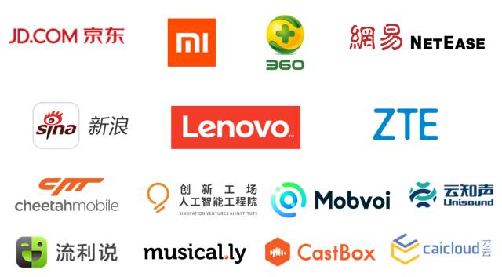

# Welcome to TensorFlow Learning Base 1

More learning: XuJing'Home [https://dataxujing.coding.me/](https://dataxujing.coding.me/)

------

+ TensorFlow（下面简称TF)是Google于2015年11月9日正式开源的深度学习框架

-----

+ 前两天的Google开发者大会在上海举办，会上宣布，TensorFlow 微信公众号正式发布！将为中国开发者提供最新的 TensorFlow 新闻、实用的技术资源、未来展望以及线下的活动信息，让中国的开发者们能够更便捷地使用 TensorFlow 打造人工智能应用。

**图1：TensorFlow微信公众号**

----
+ TF计算框架可以很好的支持深度学习的各种算法，但其应用也不局限于深度学习（本教程会忽略掉对其他算法的支持）

----
+ TF是Jeff Dean领头的Google Brain团队基于Google的内部第一代深度学习系统DistBelief（2011年）改进而来的通用计算框架

----
+ DistBelief的业绩：InmageNet2014冠军，在海量的非标注的YouTube视屏中习得了‘猫’的概念，并在Google图片中开创了图片搜索的功能，使用DistBelief框架训练的语音识别模型成功将识别的错误率降低了25%（这个提高是过去十年提高率的总和）遗憾的是DistBelief依托于Google内部系统架构很难对外开源。

----
+ 2011年11月份正式发布了基于Apache2.0的开源协议框架TensorFlow(支持多平台，计算速度更快，支持算法更广，系统更稳定)

----
+ TF在Google的应用：RankBrain（Google核心网页搜索算法），语音搜索，广告，电商，图片，街景，翻译，YouTube都可以看到基于TensorFlow的系统

----
+ Google DeepMind团队宣布在之后的所有研究都是用TF作为实现深度学习的工具。

----
+ 中山大学的研究人员利用 TensorFlow 监测城市土地的利用模式 (https://arxiv.org/pdf/1708.01580.pdf)。随着中国经济的高速增长，土地监测利用对城市规划、环境监测和发展具有十分重要的意义。

+ 清华大学的 AI 研究团队扩展了 TensorFlow，开源了 Python 概率编程库 Zhusuan（珠算：http://zhusuan.readthedocs.io/en/latest)，结合了贝叶斯方法和深度学习的优点。

+ 京东把 TensorFlow 使用在多个产品中，包括广告、OCR、客服机器人和智能音箱等，并且构建了基于 TensorFlow 的大规模深度学习系统。

+ 下图中的所有公司，比如小米、360、网易、新浪、联想和中兴等都广泛使用了 TensorFlow，来解决图像、自然语言理解、语音和推荐等多样的问题。更多的案例正在整理当中。

**图2：使用TensorFlow的企业**

除了TF还有其他深度学习框架

**表1：主流的深度学习开源工具总结表**

| 工具名称        | 主要维护团队                      | 支持语言                          | 支持系统       |
| ----------------| --------------------------------- | --------------------------------- |----------------|
| Caffe           | 加州大学伯克利分校视觉与学习中心  | C++1,pyhon,Matlab      |linux,win,Mac  |
| Deeplearning4j  | Skymind                           | Java2.Scale,Clojure    | 3+Android      |
| CNTK            | 微软研究院                        | Python,C++,BrainScript            | Linux,Win      |
| MxNet           | DMLC                              | C++,Python,Julia,Matlab,Go,R,Scale| 3+Android+ ios |
| PaddlePaddle    | 百度                              | C++,Python                        | Linux,Mac      |
| Tensorflow      | 谷歌                              | C++,Python,Java,Go,(R非官方)      | 3+Android+ios  |
| Theano          | 蒙特利尔大学                      | Python                            | Linux,Win,Mac  |
| Toech           | FaceBook,Twitter,Google           | C,Lua                             | 3+Android+ ios |
| Keras           | Taehoon Lee(一个人)               | Python,(R非官方的)                | Linux,Win,Mac  |

[1] *C，C++，C#三者区别*:
继承关系是C->C++->C# C++完全向C兼容,C程序几乎不用修改即可在C++的编译器上运行.C++也称为带类的C,在C的基础上增加了许多面向对象的概念.虽然是C的扩展,但 并不意味着C功能不如C++,最牛的操作系统是用C写的(不是C++哦). 
C#是微软弄的一个东东,继承了C和C++的许多东西,但和两者基本上 已完全不一样了.你可以把它当作一种全新的语言来学. 

[2] *java与javascript两者的关系* Java是一门面向对象编程语言，不仅吸收了C++语言的各种优点，还摒弃了C++里难以理解的多继承、指针等概念，因此Java语言具有功能强大和简单易用两个特征。Java语言作为静态面向对象编程语言的代表，极好地实现了面向对象理论，允许程序员以优雅的思维方式进行复杂的编程。
Java具有简单性、面向对象、分布式、健壮性、安全性、平台独立与可移植性、多线程、动态性等特点。Java可以编写桌面应用程序、Web应用程序（成为主流）、分布式系统和嵌入式系统应用程序等,Netscape为了搭上媒体热炒Java的顺风车，临时把LiveScript改名为JavaScript，所以从本质上来说JavaScript和Java没什么关系。JavaScript一种直译式脚本语言，是一种动态类型、弱类型、基于原型的语言，内置支持类型。它的解释器被称为JavaScript引擎，为浏览器的一部分，广泛用于客户端的脚本语言，最早是在HTML（标准通用标记语言下的一个应用）网页上使用，用来给HTML网页增加动态功能。

[注] TensorFlow Lite，这个版本是 TensorFlow 面向移动和嵌入式设备的轻量级解决方案（也就是说TensorFlow开始支持 Android系统）